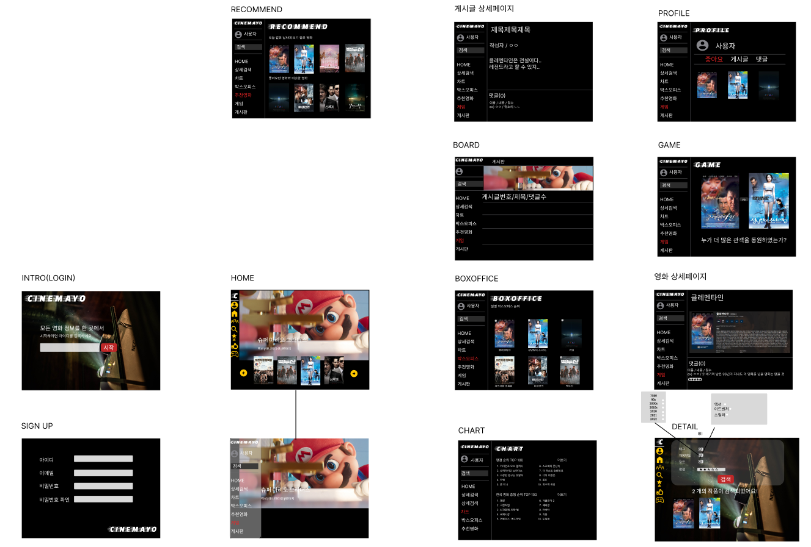
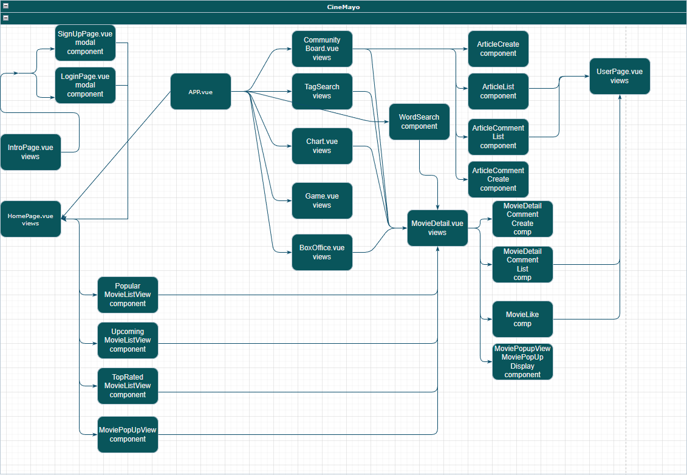

# 관통 PJT

[CINEMAYO](https://www.notion.so/d3eb72ae06a544d9b988c80bb9806d50)


## 프로젝트 기간

---

📅 2023.05.16 ~ 2023.05.25 (배포)

🙋‍♂️2023.05.26 (발표)

### 사용 프로그램

---

back-end:

- Django

front-end:

- Vue
- bootstrap-vue

## 타임라인

---

back 기본 구조 

- [~~settings.py](http://settings.py) 세팅~~
- ~~requirements.txt 작성~~
- ~~gitignore 작성~~

DB 구조 생성

- ~~JSON을 통해 장르와 영화 정보 api를 통해 받아오기~~

movies

- ~~models~~
- ~~serializers~~
- ~~views~~

accounts

- ~~models~~
- ~~serializers~~
- ~~views~~

board

- ~~serializers~~
- ~~views~~
- ~~models~~

~~추천 알고리즘~~

## 초기 아이디어

---

- 앱기반 디자인의 웹페이지 생성
    - aside를 fix
- kofic의 일별 박스오피스 API를 사용하여 현재 상영되는 영화 순위를 알려주는 페이지 생성
- 체크박스를 사용한 상세 검색 페이지
- **추천 알고리즘은 코사인유사도를 사용하거나 현재 날씨를 통해, 좋아요한 장르들 중 랜덤하게 추천해주게 할 예정**
    - 최근 클릭한 10개의 디테일 영화의 장르 3개 가져와서 추천
    - 마지막으로 본 상세 영화와 비슷한 영화 추천, tmdb Recommendations api 사용
    - OpenWeatherMap api를 사용해서 현재 날씨와 비슷한 장르의 영화 추천

## 와이드 프레임

---



# 프로젝트 제작 목표

---

- 영화 추천 알고리즘 기반 커뮤니티 서비스 구현
- API를 통한 영화 정보 활용
- 백엔드 서버와 프론트엔드 연결
- 부트스트랩 등의 디자인 플러그인을 통한 뷰 디자인 작성
- 웹 어플리케이션에서의 CRUD 를 게시글, 댓글 등의 여러 형태로 구현

# 담당 부분 협의

---

- 백 - 김제준
- 프론트 - 강동우
- 디자인 - 공동작업

# 기능 및 페이지에 대한 아이디어 브레인스토밍

---

명세 작성(5/17일 작성됨)

- **어드민 페이지**
    - 각 게시판 및 작성글, 회원에 대한 자유로운 접근과 관리 가능
- **인트로 페이지**
    - 상단 로고, 랜덤한 이미지를 배경으로 구성
    - 로그인, 회원가입으로 이어지는 버튼
    - 새로고침 없이 modal창으로 구성되는 회원 가입 창 또는 로그인 창
- **메인 페이지(HOME)**
    - 좌측 세로로 나열된 아이콘 목록을 통한 대략적인 기능 소개
    - 아이콘 목록 클릭 시 반투명 배경의 상세 기능 창 등장(hover하면 색이 바뀌어야 함)
    - 11시의 홈 버튼 기능을 하는 로고
    - 회원 아이콘과 회원 이름
    - 영화명, 배우명, 감독명 등 키워드로 검색하는 검색창(검색 추천이 검색창과 함께 떠야 함)
    - 메인 페이지로 이동하는 HOME
    - 태그를 체크하는 방식으로 검색할 수 있는 태그 검색 페이지 이동
    - 차트, 박스오피스 이동
    - 게임 페이지 이동
    - 메인 페이지의 배경으로는 유튜브 키를 이용한 트레일러가 재생되도록 동시에 영화 제목과 장르 등의 간략한 정보가 함께 노출되도록 설정, 재생 중인 트레일러의 좌우를 찍어주면 다른 랜덤한 트레일러와 간략한 영화정보로 교체
    - 영화 리스트를 특정한 기준에 따라 커튼식으로 나열, 좌우에 화살표 버튼을 두고 이동하도록 설정, 끝까지 보여준 뒤에는 다시 원래대로 돌리기
    - 항목에 따른 영화 노출 뒤에는 영화 포스터를 자유롭게 보여주면서 인피니티 스크롤로 계속 띄워준다.
    - 영화 포스터에 마우스 호버링하면 제목과 평점이 뜨고, 클릭할 경우 개별 영화 상세 페이지로 이동
- **영화 상세 페이지**
    - 모달창을 통해서 새로고침 없이 구성되도록 함
    - 바깥 찍으면 꺼지도록 만든다.
    - 검색결과, 영화 포스터 클릭, 메인 화면의 배경 영상 재생 쪽의 상세보기를 통해 이동하는 모달창
    - 메뉴 기능은 그대로 유지되어야 함.
    - 상부에 영화 제목, 영화 포스터와 상세 정보를 나열하고, 밑에는 관련 유튜브 영상을 띄울 수 있도록 함. 가능하다면 배우 사진 등 여러 사진정보를 함께 띄울 수 있으면 좋겠음
    - 가장 밑에는 별점기능 포함한 댓글 기능 구현. 대댓글 기능까지 구현
    - 가장 밑에는 비슷한 추천 영화를 띄우는 방식 필요
    - 좋아요 기능 필요
    - 목업과는 살짝 다르게 만들어질 예정이므로 주의!
- **박스오피스 페이지**
    - 한국영화진흥원 API를 사용해서 현재 개봉 중인 영화에 대한 정보를 띄움
    - 일별, 주간 박스오피스 정보를 띄우고, 영화 정보를 기록한 jSON 통해서 영화상세 API와 연결, 영화상세로 이어지도록 함.
    - 영화 포스터를 띄우는 형태로 레이아웃 구성
- **영화 차트 페이지**
    - API 로 받은 전체 영화에 대해서 추천,
    - 영화 상세페이지로 이어질 수 있도록 함.
    - 기본적인 구성은 박스오피스 페이지처럼 구성하되 추천 영화도 같이 띄워주도록 함.
- **게시판 기능**
    - 자유게시판 형태로 구성하고, 작성 시에 게시글 성격을 (자유,리뷰)로 바꿀 수 있음.
    - 리뷰 선택 시에는 포스터 검색 창을 통해 포스터 그림이 추가, 별점 기능도 추가됨.
    - 다른 사용자를 클릭하면 해당 사용자의 페이지로 이동 가능.
    - 여기 작성한 글에 대해서 좋아요를 받으면 사용자 페이지에 받은 좋아요가 표시됨
- **사용자 페이지**
    - 이 사용자가 받은 총 좋아요의 갯수를 이름 옆에 띄움
    - 항목은 좋아요/게시글/댓글 로 구성
    - 사용자가 좋아요 한 영화들의 포스터를 띄우고, 클릭한 경우 영화상세 페이지로 이동
    - 게시글 항목은 해당 사용자가 작성한 글을 띄움
    - 댓글 항목은 해당 사용자가 작성한 댓글을 띄움
- **상세검색 페이지**
    - 태그 검색 위주로 진행하며, 영화평점, 태그 추가 등의 방식으로 검색을 진행함. 검색 결과를 포스터 나열로 아래에 노출시키고, 클릭하면 영화상세 모달창을 띄움
- **~~게임 기능(선택)~~**
    - ~~필수 기능 구현 후 가능한 때에 새로 작성함~~
    - ~~두 영화를 띄우고 평점이 더 높거나? 관객수가 더 높거나? 하면서 맞힌 경우 점수를 주고, 점수가 높으면 메인화면, 유저 창에서 계급장을 표시하도록 함.~~

# Vue ERD

---



## Django ERD

---


## Vue components

---

| Main | 전체 영화 리스트
popular, top rated, upcoming 항목으로 다른 영화를 노출 포스터 형태로 |
| --- | --- |
| Detail | 영화상세 modal 창으로 구현, 영화 좋아요, 댓글 작성, 댓글 좋아요 |
| Comment | 영화상세 페이지, 게시판의 게시글에 작성가능, profile에서 확인 가능, 게시글 수정 삭제 및 댓글 기능, 좋아요 기능 구현 |
| Search | 제목을 통한 검색추천 기능, 태그를 추가하는 형태의 상세검색 기능 |
| Recommend | 날씨 API를 통한 추천, 최근 클릭한 데이터를 통한 추천, 마지막 클릭 영화와 비슷한 영화 추천 |
| Profile | 회원정보 좋아요받은 갯수, 좋아요 한 영화, 작성글, 작성댓글 확인가능 |
| Create | 게시글,게시판 글에 대한 댓글, 영화상세에 대한 댓글, 좋아요 |
| Account | 가입, 로그인  |
| Box office | Box office API를 통해 주간 일간 박스오피스 순위 확인 가능 |

# Install Guide

---

### Back guide

```python
pip install -r requirements.txt
```

### Front guide

```python
npm install
* err 발생시 npm install --force
npm install bootstrap-vue
npm uninstall swiper
npm install swiper@6
npm uninstall vue-awesome-swiper
npm install vue-awesome-swiper@3.1.3
```

*오류 발생시

```python
npm install --legacy-peer-deps
npm audit fix --force
```

## 느낀점

---

- 김제준
    
    아무것도 없는 상태에서 프로그램을 만드는 것에 익숙하지 않은 탓인지 처음에는 막막함이 많이 앞섰지만 하루이틀 지나면서 현 상황에 익숙해지면서 구현 속도도 빨라지고 디버깅도 빠르게 진행할 수 있었다. 타이트한 일정에 기존에 구현하고자 하였던 내용에서 많은 부분의 변경이 발생하였으며 이에 대해 많은 아쉬움이 남는다. 기존에는 모바일 어플리케이션기반의 웹페이지를 구현하고자 하였지만 bootstrap-vue에 대한 이해가 부족하여 일반적인 웹페이지로 변경이 이루어졌으며 또한 코사인 유사도를 사용한 추천알고리즘을 사용하고자 하였지만 방대한 양의 데이터, 최적화의 어려움으로 구현에 어려움이 있어 이 부분이 빠진 것이 개인적으로 가장 아쉬운 부분이다. 이를 보강하기 위해 최근 클릭한 영화들의 장르 정보를 가지고 가장 많이 검색된 장르 Top 3를 가져와 데이터 베이스에서 인기도 순으로 10개 가량 추천해주는 방식의 알고리즘과 가장 최근에 클릭한 영화 정보를 가지고 TMDB의 Search API를 사용하여 이와 비슷한 영화를 최대 10개까지 추천해주는 알고리즘과 현재 대한민국의 날씨 정보를 가지고 날씨에 맞는 장르를 랜덤으로 3개 가져와 각각 10개씩 추천해주는 알고리즘을 만들었다. 만들면서 Django에서 외래키에 대해서 가장 많이 오류가 났었으며 개인적으로도 이해가 부족하다고 느끼는 부분이었다. 이에 대해 더욱 지식을 쌓아야겠다고 다짐했으며 front를 도우면서 느낀 것은 아직 vuex를 기능을 적극적으로 사용하지 못했다고 느꼈다. 그렇기에 각 컴포넌트별로 중복되는 코드가 다수 존재하게 되었으며 직관성이 떨어지는 문제, 같은 코드를 여러번 수정해야하는 문제가 생겼다. 조금 더 시간을 효율적으로 사용하였으면 더욱 좋은 결과가 나오지 않았을까하는 아쉬움이 남는 프로젝트였다.
    
- 강동우